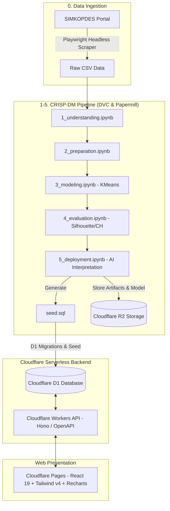

# 🌾 KOPDES — SIMKOPDES Analytics & MLOps Platform

[](.github/workflows/main.yml)
[](https://dvc.org)
[](https://workers.cloudflare.com)
[-0051C3?style=for-the-badge&logo=sqlite&logoColor=white)](https://developers.cloudflare.com/d1/)
[](web/frontend)

**KOPDES** adalah platform analitik dan machine learning *end-to-end* yang menerapkan metodologi **CRISP-DM 1.0 (Cross-Industry Standard Process for Data Mining)** untuk mengumpulkan, memproses, mengelompokkan (clustering), mengevaluasi, dan mendiseminasikan data profil serta performa Koperasi Desa di seluruh Indonesia dari portal [SIMKOPDES](https://simkopdes.go.id).

---

## 📌 Daftar Isi

- [Arsitektur Sistem](#-arsitektur-sistem)
- [Teknologi & Stack](#-teknologi--stack)
- [Tahapan CRISP-DM](#-tahapan-crisp-dm)
- [Struktur Direktori](#-struktur-direktori)
- [Panduan Instalasi & Penggunaan Lokal](#-panduan-instalasi--penggunaan-lokal)
  - [Prasyarat](#prasyarat)
  - [1. Clone Repository & Konfigurasi Environment](#1-clone-repository--konfigurasi-environment)
  - [2. Setup Python & DVC Data Pipeline](#2-setup-python--dvc-data-pipeline)
  - [3. Menjalankan Backend (Cloudflare Workers + D1)](#3-menjalankan-backend-cloudflare-workers--d1)
  - [4. Menjalankan Frontend (React 19 + Vite)](#4-menjalankan-frontend-react-19--vite)
- [CI/CD & Otomatisasi GitHub Actions](#-cicd--otomatisasi-github-actions)
- [Lisensi & Kontributor](#-lisensi--kontributor)

---

## 🏛️ Arsitektur Sistem



---

## 🚀 Teknologi & Stack

### Data Pipeline & MLOps
- **Python 3.12+** & **Papermill**: Eksekusi notebook analitik modular secara terotomatisasi dan parametrik.
- **Playwright**: Web scraping dinamis untuk ekstraksi data tabel hierarki provinsi dan kabupaten/kota dari SIMKOPDES.
- **DVC (Data Version Control)** + **dvc-s3**: Versioning dataset, tracking dependensi pipeline (`dvc.yaml`), dan remote storage berbasis **Cloudflare R2 (S3-compatible)**.
- **Scikit-Learn**: Algoritma K-Means Clustering, Standard Scaling, dan evaluasi metrik (*Silhouette Score, Calinski-Harabasz Index, Davies-Bouldin Index*).
- **Cloudflare Workers AI (LLM)**: Ekstraksi insight eksekutif dan deskripsi profil cluster berbasis model AI terkelola (`@cf/openai/gpt-oss-120b`).

### Backend (Cloudflare Workers)
- **Runtime**: Cloudflare Workers (Serverless Edge Runtime).
- **Framework**: [Hono](https://hono.dev/) dengan `@hono/zod-openapi` untuk type-safety dan dokumentasi Swagger/OpenAPI otomatis.
- **Database**: Cloudflare D1 (Serverless Distributed SQLite).

### Frontend (Cloudflare Pages)
- **Framework**: React 19, TypeScript, Vite.
- **Design System**: Astryx Design System (`@astryxdesign/core`, `@astryxdesign/theme-neutral`), StyleX, Lucide Icons, Figtree Font, Dark/Light Mode.
- **Visualisasi**: Leaflet Map (Spatial Cluster Map), Astryx Markdown & Analytics Cards.

---

## 🔬 Tahapan CRISP-DM

| Tahap | Berkas / Notebook | Deskripsi |
| :--- | :--- | :--- |
| **0. Ingestion** | `src/scrape_provinces.py`, `src/scrape_regencies.py` | Scraping data provinsi & kabupaten/kota (NIB, NPWP, RAT, modal, transaksi). |
| **1. Data Understanding** | `src/1_understanding.ipynb` | Analisis statistik deskriptif, missing values, skewness, dan korelasi fitur koperasi. |
| **2. Data Preparation** | `src/2_preparation.ipynb` | Cleaning teks daerah, imputasi, feature engineering (rasio legalitas/keaktifan), dan *Robust/Standard Scaling*. |
| **3. Modeling** | `src/3_modeling.ipynb` | Pencarian cluster optimal via *Elbow Method* & *Kneedle Algorithm*, fitting K-Means model, dan penyimpanan model `.pkl`. |
| **4. Evaluation** | `src/4_evaluation.ipynb` | Validasi kualitas klasterisasi menggunakan *Silhouette Coefficient*, *Davies-Bouldin*, dan *Calinski-Harabasz*. |
| **5. Deployment** | `src/5_deployment.ipynb` | Profiling klaster otomatis via Workers AI LLM, pembuatan berkas `seed.sql`, dan ekspor visualisasi. |

---

## 📂 Struktur Direktori

```text
kopdes/
├── .github/
│   ├── actions/               # Composite GitHub Actions (setup-pipeline, push-pipeline)
│   └── workflows/
│       └── main.yml           # CI/CD End-to-End Orchestration Workflow
├── .dvc/                      # Konfigurasi DVC & R2 Remote Storage
├── data/                      # Data storage per tahapan CRISP-DM
│   ├── scrape/                # Data mentah hasil scraping
│   ├── 2_preparation/         # Data bersih & fitur ternormalisasi
│   ├── 3_modeling/            # Data hasil clustering regencies
│   └── 5_deployment/          # Berkas seed.sql database D1
├── models/                    # Model machine learning tersimpan (kmeans_model.pkl)
├── src/                       # Source code pipeline analitik
│   ├── scrape_util.py         # Modul utilitas scraping & parser tabel HTML
│   ├── scrape_provinces.py    # Script scraping data tingkat provinsi
│   ├── scrape_regencies.py    # Script scraping data tingkat kabupaten/kota
│   ├── 1_understanding.ipynb  # Notebook eksplorasi & pemahaman data
│   ├── 2_preparation.ipynb    # Notebook pra-pemrosesan data
│   ├── 3_modeling.ipynb       # Notebook pemodelan K-Means
│   ├── 4_evaluation.ipynb     # Notebook evaluasi metrik
│   ├── 5_deployment.ipynb     # Notebook intepretasi LLM & seed generator
│   ├── config.py              # Konfigurasi konstanta & fitur global
│   ├── report.py              # Generator laporan markdown & upload gambar ke R2
│   └── outs/                  # Output notebook hasil eksekusi Papermill
├── web/
│   ├── backend/               # Cloudflare Workers API (Hono + D1 Database)
│   │   ├── migrations/        # Skema migrasi database D1
│   │   ├── src/               # Controllers, routes, & model OpenAPI
│   │   └── wrangler.jsonc     # Konfigurasi Cloudflare Wrangler Worker
│   └── frontend/              # Cloudflare Pages React Dashboard
│       ├── src/               # Komponen React, visualisasi Recharts, hooks
│       └── wrangler.json      # Konfigurasi Cloudflare Pages
├── dvc.yaml                   # Definisi DAG Pipeline DVC
├── params.yaml                # Parameter hyperparameter pipeline
├── pyproject.toml             # Python package configuration
└── requirements.txt           # Python dependencies
```

---

## 💻 Panduan Instalasi & Penggunaan Lokal

### Prasyarat
- **Python** $\ge$ 3.10
- **Node.js** $\ge$ 20 & **npm**
- **Git** & **DVC**

---

### 1. Clone Repository & Konfigurasi Environment

```bash
git clone https://github.com/qoriib/kopdes.git
cd kopdes
```

Salin template environment variable dan isi kunci API yang diperlukan:

```bash
cp .env.example .env
```

Isi variabel pada file `.env`:
```ini
AWS_ACCESS_KEY_ID=<your_cloudflare_r2_access_key>
AWS_SECRET_ACCESS_KEY=<your_cloudflare_r2_secret_key>
CLOUDFLARE_ACCOUNT_ID=<your_cloudflare_account_id>
CLOUDFLARE_API_TOKEN=<your_cloudflare_api_token>
R2_BUCKET=kopdes
R2_PUBLIC_URL=https://<your_r2_public_url>
```

---

### 2. Setup Python & DVC Data Pipeline

```bash
# Buat dan aktifkan virtual environment
python -m venv .venv
# Windows:
.venv\Scripts\activate
# Linux/macOS:
source .venv/bin/activate

# Install dependencies Python
pip install -r requirements.txt
pip install -e .

# Install browser Chromium untuk scraping (Playwright)
playwright install chromium --with-deps

# Unduh dataset cache dari DVC remote (Cloudflare R2)
dvc pull

# Jalankan seluruh pipeline CRISP-DM
dvc repro
```

---

### 3. Menjalankan Backend (Cloudflare Workers + D1)

```bash
cd web/backend
npm install

# Terapkan migrasi skema database D1 secara lokal
npx wrangler d1 migrations apply simkopdes_db --local

# Isi data awal database dari hasil pipeline
npx wrangler d1 execute simkopdes_db --local --file=../../data/5_deployment/seed.sql

# Jalankan server backend lokal
npm run dev
```
> API backend lokal akan berjalan di `http://localhost:8787` (Swagger Docs: `http://localhost:8787/api/doc`).

---

### 4. Menjalankan Frontend (React 19 + Vite)

Buka terminal baru:

```bash
cd web/frontend
npm install

# Jalankan server frontend lokal
npm run dev
```
> Dashboard frontend interaktif dapat diakses di `http://localhost:5173`.

---

## 🔄 CI/CD & Otomatisasi GitHub Actions

Workflow terpusat pada [`.github/workflows/main.yml`](.github/workflows/main.yml) menjalankan otomatisasi end-to-end setiap kali di-trigger via `workflow_dispatch`:

1. **Scrape Job**: Mengambil data terbaru dari portal SIMKOPDES via Playwright headless browser.
2. **Pipeline Job**:
   - Menjalankan `dvc repro` untuk memproses seluruh tahapan analitik & model training.
   - Mengonversi notebook ke laporan Markdown dan mempublikasikan visualisasi plot via **CML (Continuous Machine Learning)** langsung ke GitHub Actions Step Summary.
   - Menerapkan migrasi skema dan melakukan seeding database ke **Cloudflare D1 Remote**.
   - Menyimpan dan menyinkronkan data cache model ke remote storage via `dvc push`.
3. **Deploy Backend Job**: Membangun dan merilis API Worker ke **Cloudflare Workers** via `cloudflare/wrangler-action@v4`.
4. **Deploy Frontend Job**: Membangun dan menerbitkan web app dashboard ke **Cloudflare Pages**.

---

## 📄 Lisensi & Kontributor

Dikembangkan oleh **[Qoriib](https://github.com/qoriib)** untuk inovasi digitalisasi dan pemetaan analitik Koperasi Desa Indonesia.

Lisensi di bawah **MIT License**.
